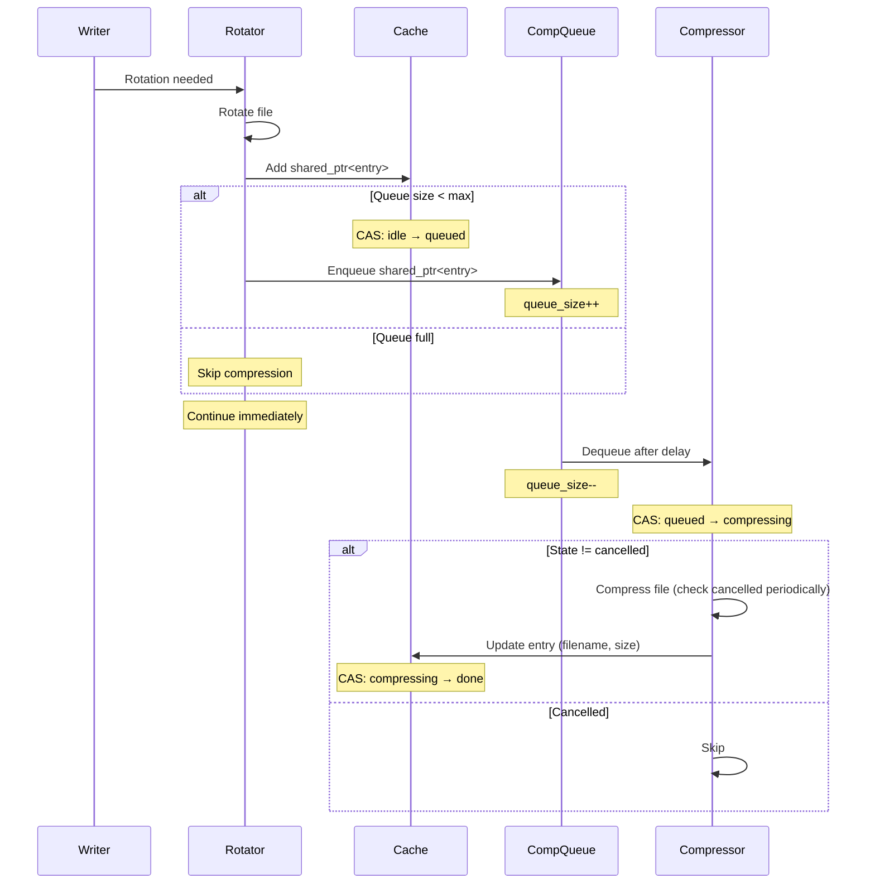
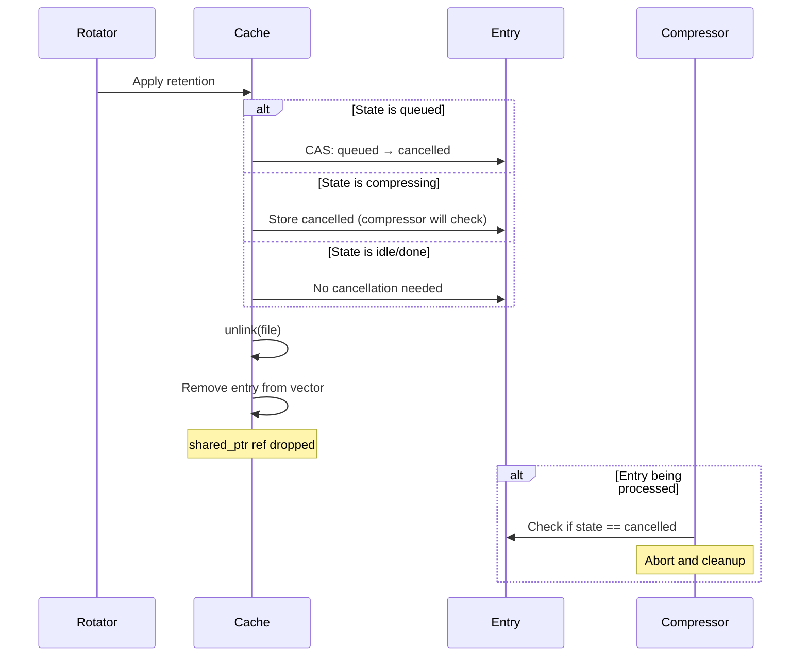

# File Compression Thread Design

**NOTE**: This is the original design idea, it now only partially reflects reality.

## Overview

This document describes the design for an optional background compression thread that handles file compression asynchronously, preventing the rotation thread from blocking on CPU-intensive compression operations.

## Problem Statement

Currently, file compression happens synchronously in the rotation thread:
- Compression is CPU-intensive and can take significant time
- During compression, the rotation thread cannot process new rotations
- With high log throughput, this creates a backlog of rotations
- The system can appear to hang as rotations queue up

## Design Goals

1. **Non-blocking rotation**: Rotation thread should never wait for compression
2. **Graceful cancellation**: Files deleted by retention should cancel pending compressions
3. **Configurable batching**: Delay compression to batch multiple files
4. **Resource management**: Prevent FD leaks and manage memory efficiently
5. **Clean shutdown**: Gracefully handle pending compressions on shutdown

## Architecture

### Core Components

#### 1. Shared File Entry Structure

```cpp
enum class compression_state : uint8_t {
    idle,        // Not queued for compression
    queued,      // In compression queue
    compressing, // Being compressed
    done,        // Compression complete
    cancelled    // Cancelled by retention
};

struct rotated_file_entry {
    std::string filename;
    std::chrono::system_clock::time_point timestamp;
    size_t size;
    std::atomic<compression_state> comp_state{compression_state::idle};
    std::weak_ptr<rotation_handle> handle;
};
```

The `rotated_file_entry` becomes the shared coordination point between threads:
- Stored as `shared_ptr` in the rotation cache
- Passed by `shared_ptr` to compression queue
- Single atomic state machine prevents race conditions

#### 2. Compression Queue with Bounded Size

```cpp
class file_rotation_service {
    // Compression thread management
    std::thread compression_thread_;
    std::atomic<bool> compression_running_{false};
    moodycamel::BlockingConcurrentQueue<std::shared_ptr<rotated_file_entry>> compression_queue_;
    
    // Queue management
    std::atomic<size_t> compression_queue_size_{0};
    size_t compression_queue_max_{100};  // Discard new compressions above this
    std::chrono::milliseconds compression_delay_{500};  // Batching delay
};
```

#### 3. Thread Lifecycle Management

```cpp
// Start compression thread with operational parameters
void start_compression_thread(
    std::chrono::milliseconds delay = std::chrono::milliseconds{500},
    size_t max_queue_size = 100
);

void stop_compression_thread();   // Stop thread and drain queue
bool is_compression_enabled();    // Query compression thread status
```

## Data Flow

### 1. Rotation with Compression



### 2. File Deletion with Cancellation



## Implementation Details

### Queue Management

```cpp
bool enqueue_for_compression(std::shared_ptr<rotated_file_entry> entry) {
    // Check queue size
    if (compression_queue_size_.load() >= compression_queue_max_) {
        // Queue full, skip compression
        return false;
    }
    
    // Try to transition state
    compression_state expected = compression_state::idle;
    if (!entry->comp_state.compare_exchange_strong(expected, compression_state::queued)) {
        // Already queued or in progress
        return false;
    }
    
    compression_queue_.enqueue(entry);
    compression_queue_size_.fetch_add(1);
    return true;
}
```

### Compression Thread Function

```cpp
void compression_thread_func() {
    constexpr size_t MAX_BATCH = 10;
    std::vector<std::shared_ptr<rotated_file_entry>> batch;
    
    while (compression_running_) {
        batch.clear();
        
        // Wait for first item with timeout (for batching)
        std::shared_ptr<rotated_file_entry> entry;
        if (!compression_queue_.wait_dequeue_timed(entry, compression_delay_)) {
            continue;  // Timeout, check running flag
        }
        
        batch.push_back(entry);
        compression_queue_size_.fetch_sub(1);
        
        // Collect additional items for batch processing
        while (batch.size() < MAX_BATCH && compression_queue_.try_dequeue(entry)) {
            batch.push_back(entry);
            compression_queue_size_.fetch_sub(1);
        }
        
        // Process batch
        for (auto& entry : batch) {
            compression_state expected = compression_state::queued;
            if (entry->comp_state.compare_exchange_strong(expected, compression_state::compressing)) {
                compress_file_with_cancellation(entry);
            }
            // If not queued anymore, it was cancelled - skip
        }
    }
    
    // Drain queue on shutdown
    drain_compression_queue();
}
```

### Modified Compression Routine

```cpp
bool compress_file_with_cancellation(std::shared_ptr<rotated_file_entry> entry) {
    const std::string& filename = entry->filename;
    std::string gz_pending = filename + ".gz.pending";
    std::string gz_final = filename + ".gz";
    
    // Clean up any leftover .pending file
    ::unlink(gz_pending.c_str());
    
    // Open source file
    int in_fd = ::open(filename.c_str(), O_RDONLY);
    if (in_fd < 0) {
        entry->comp_state = compression_state::done;  // File gone, mark done
        return false;
    }
    
    // Open destination file
    int out_fd = ::open(gz_pending.c_str(), O_WRONLY | O_CREAT | O_EXCL, 0644);
    if (out_fd < 0) {
        ::close(in_fd);
        entry->comp_state = compression_state::done;
        return false;
    }
    
    // Compression loop with cancellation checks
    constexpr size_t BLOCK_SIZE = 64 * 1024;
    uint8_t buffer[BLOCK_SIZE];
    mz_stream stream = {};
    mz_deflateInit2(&stream, MZ_DEFAULT_COMPRESSION, MZ_DEFLATED, 
                    MZ_DEFAULT_WINDOW_BITS + 16, 8, MZ_DEFAULT_STRATEGY);
    
    while (true) {
        // Check for cancellation after each block
        if (entry->comp_state == compression_state::cancelled) {
            ::close(in_fd);
            ::close(out_fd);
            ::unlink(gz_pending.c_str());
            mz_deflateEnd(&stream);
            return false;
        }
        
        ssize_t bytes_read = ::read(in_fd, buffer, BLOCK_SIZE);
        if (bytes_read <= 0) break;
        
        // Compress and write...
        // (actual compression code here)
    }
    
    mz_deflateEnd(&stream);
    ::close(in_fd);
    ::close(out_fd);
    
    // Atomic rename to final name
    if (::rename(gz_pending.c_str(), gz_final.c_str()) == 0) {
        ::unlink(filename.c_str());  // Delete original
        
        // Update entry
        if (auto handle = entry->handle.lock()) {
            std::lock_guard<std::mutex> lock(handle->cache_mutex_);
            entry->filename = gz_final;
            struct stat st;
            if (::stat(gz_final.c_str(), &st) == 0) {
                entry->size = st.st_size;
            }
        }
        entry->comp_state = compression_state::done;
        return true;
    }
    
    // Cleanup on failure
    ::unlink(gz_pending.c_str());
    entry->comp_state = compression_state::done;
    return false;
}
```

### Starting/Stopping Compression Thread

```cpp
void start_compression_thread(
    std::chrono::milliseconds delay = std::chrono::milliseconds{500},
    size_t max_queue_size = 100) 
{
    bool expected = false;
    if (compression_running_.compare_exchange_strong(expected, true)) {
        compression_delay_ = delay;
        compression_queue_max_ = max_queue_size;
        compression_thread_ = std::thread(&file_rotation_service::compression_thread_func, this);
    }
}

void stop_compression_thread() {
    compression_running_ = false;
    compression_queue_.enqueue(nullptr);  // Wake thread
    if (compression_thread_.joinable()) {
        compression_thread_.join();
    }
}
```

## Configuration

### Rotation Policy (Simplified)

```cpp
struct rotate_policy {
    // Existing fields...
    bool compress = false;  // Enable compression (files will be queued for compression)
    // Note: compression delay and queue size are operational parameters
    // passed to start_compression_thread(), not policy settings
};
```

### Runtime Control

```cpp
// Start compression thread with operational parameters
file_rotation_service::instance().start_compression_thread(
    std::chrono::milliseconds{500},  // Delay before compression
    100                               // Max queue size
);

// In rotation handle creation
if (policy.compress && file_rotation_service::instance().is_compression_enabled()) {
    // Files will be queued for compression
}
```

## Error Handling

### File Not Found
- If file deleted between queueing and compression, skip silently
- This is expected behavior when retention runs

### Compression Failures
- Increment failure metrics
- Clean up .pending files
- Log if not in rotation thread context

### Handle Expiry
- Check `weak_ptr` validity before updating cache
- If handle gone, still complete compression but skip cache update

## Performance Considerations

### Batching Benefits
- Amortize thread wake overhead
- Better CPU cache utilization
- Potential for parallel compression (future)

### Memory Management
- `shared_ptr` overhead is minimal (one allocation per file)
- Queue size naturally bounded by rotation rate
- No additional maps or lookups needed

### FD Management
- No FDs held across thread boundaries
- Open on demand in compression thread
- Automatic cleanup on all error paths

## Testing Strategy

### Unit Tests
1. Compression with cancellation before start
2. Compression with cancellation during operation
3. Queue drainage on shutdown
4. Batch processing with mixed cancelled/valid entries

### Integration Tests
1. High-throughput rotation with compression
2. Retention deleting files during compression
3. ENOSPC handling with compression queue
4. Clean shutdown with pending compressions

### Stress Tests
1. Thousands of small files queued rapidly
2. Large files with slow compression
3. Alternating enable/disable compression thread
4. Memory leak detection with long runs

## Future Enhancements

### Compression Thread Pool
- Multiple compression threads for parallel processing
- Work stealing queue for load balancing

### Adaptive Behavior
- Monitor compression queue depth
- Auto-disable if queue grows too large
- Resume when queue drains

### Compression Levels
- Different compression levels based on file age
- Quick compression for recent files
- Maximum compression for archived files

## Risks and Mitigations

| Risk                                | Mitigation                                          |
|-------------------------------------|-----------------------------------------------------|
| Compression queue grows unbounded   | Monitor depth, skip new compressions if > threshold |
| Compression thread crashes          | Restart thread or disable compression               |
| Files deleted during compression    | Check cancellation flag periodically                |
| Memory leaks from shared_ptr cycles | Use weak_ptr for back-references                    |
| FD exhaustion                       | Never hold FDs across operations                    |

## Conclusion

This design provides a clean separation between rotation and compression, eliminating blocking operations in the critical rotation path while maintaining data consistency and proper resource management. The use of `shared_ptr<rotated_file_entry>` as the coordination mechanism provides an elegant solution for cancellation and state management between threads.